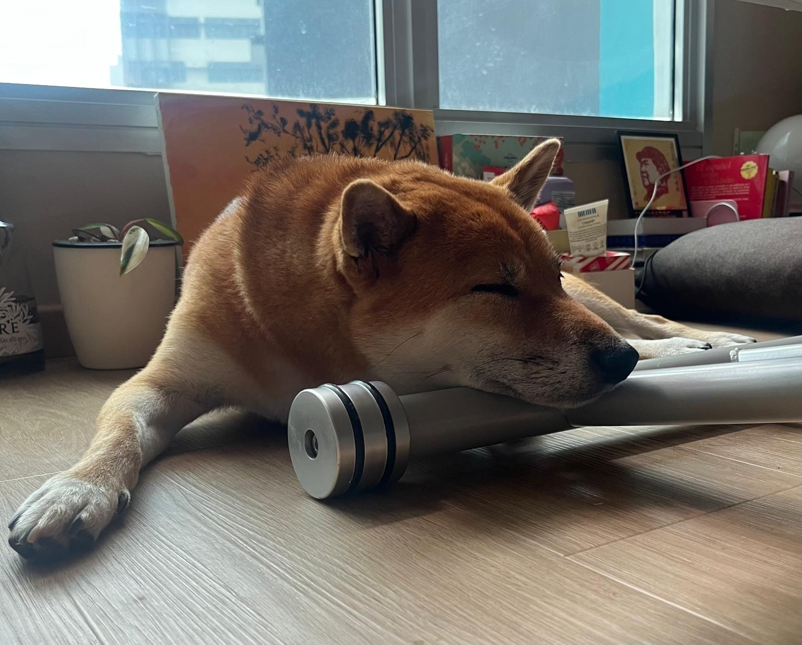
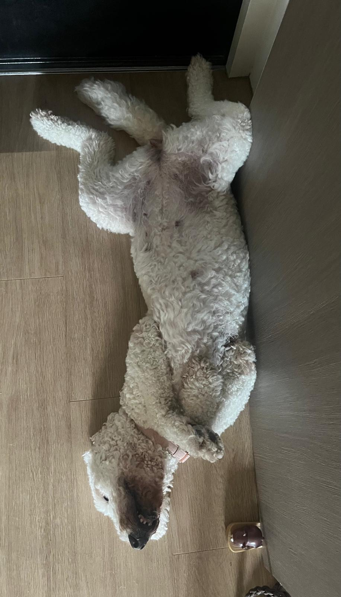
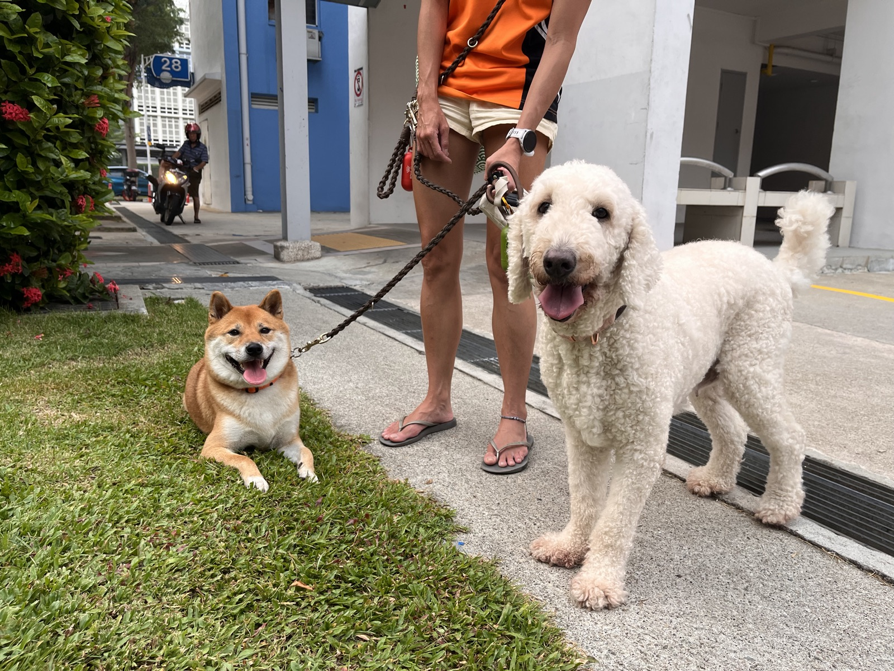
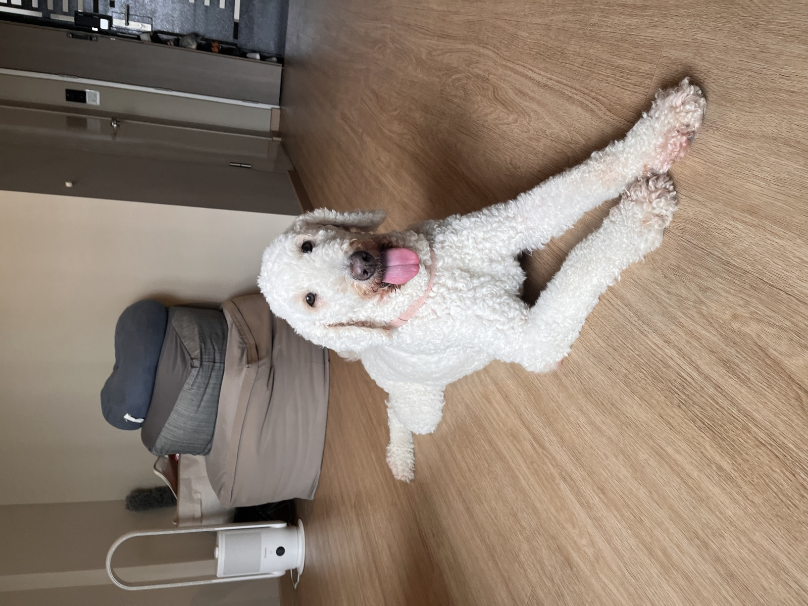
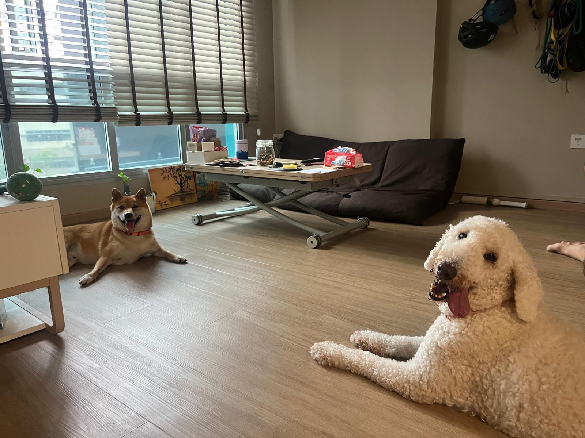
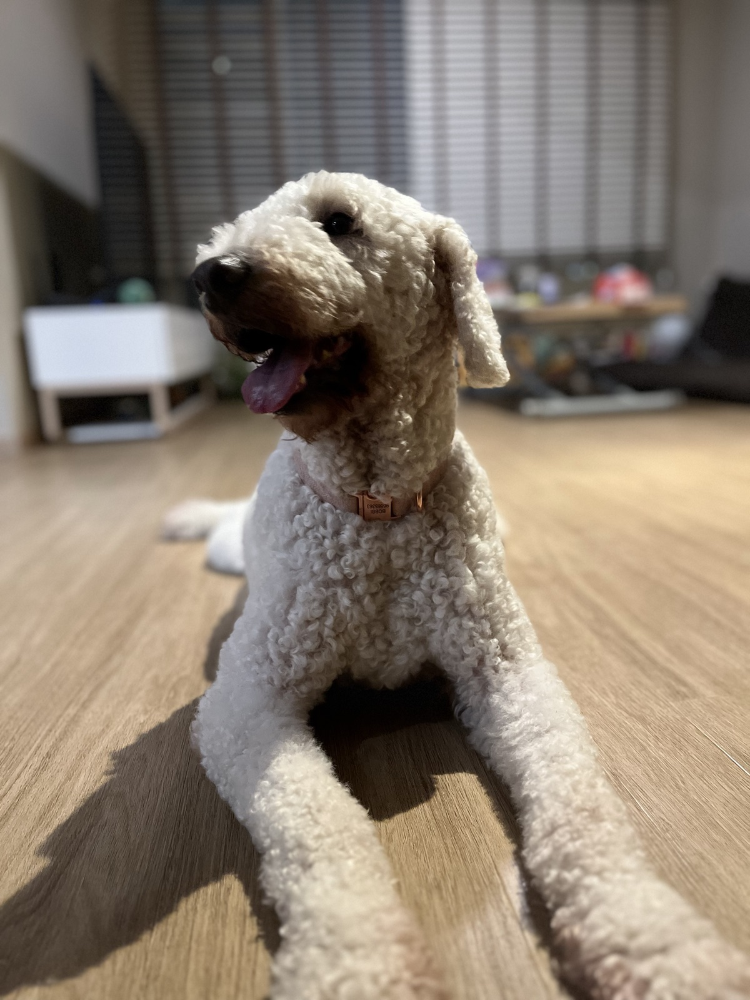
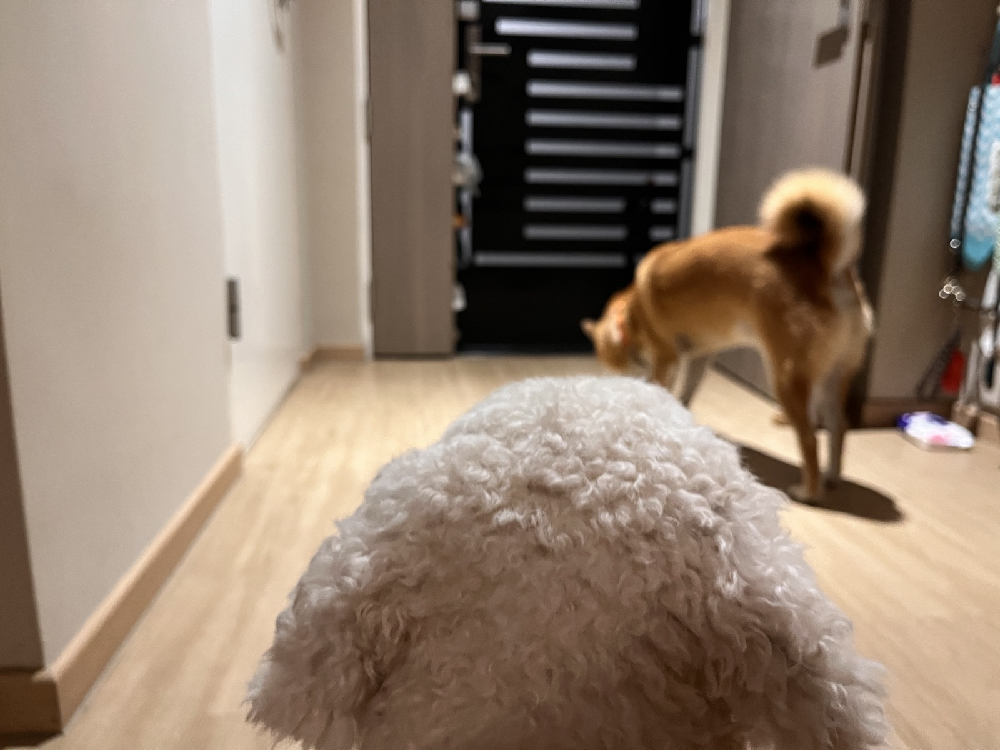

## 10 Oct

### 2:48pm

<!-- entry-id: e070 -->
<!-- with: guapo -->

Featured sleeping positions of the day. Guapo, dreaming of a sumptuous meal. Bobbi, praying in her sleep not to be part of the sumptuous meal.

### 12:38pm

<!-- entry-id: e068 -->

The entrance to our house was Bobbi’s favourite spot. Alan could lure her away, but she always came back to lie there.

### 8am

<!-- entry-id: e066 -->

Rare sighting of Bobbi playing with another dog, Lingo.

### 7:48am

<!-- entry-id: e067 -->
<!-- with: guapo -->

Two chill dogs waited for Alan to buy breakfast. None of it was for them.

## 9 Oct

### 6pm

<!-- entry-id: e065 -->
<!-- with: guapo -->

Teddy the Coton de Tulear made a Formula One car entrance, zooming past the doggos. No pit stop required.

### 2:25pm

<!-- entry-id: e063 -->
<!-- with: guapo -->

Alan had a heart attack when Guapo opened his mouth wide like he was choking. He was just trying to get the dried tenderloin snack unstuck from his bottom teeth by dragging his mouth against the floor. Weiwen saw what was actually happening, so she didn’t react. Bobbi was just enjoying her snack amidst the little commotion.

### 1:40pm

<!-- entry-id: e064 -->

Baa baa Bobbi, have you any wool?

### 9:12am

<!-- entry-id: e062 -->
<!-- with: guapo -->

Bobbi's invitation to play, ignored by Guapo. Both dogs ended up going to their favourite person.

### 7:55am

<!-- entry-id: e061 -->
<!-- with: guapo -->

Say cheese... no cheese treats though.

### 7:40am

<!-- entry-id: e060 -->
<!-- with: guapo -->

Back from the morning walk with the sheep and the fox.

## 8 Oct

### 10:54pm

<!-- entry-id: e058 -->

Relax, Bobbi. Guapo is not going to eat you up. He eats spiders now.

### 10:45pm

<!-- entry-id: e059 -->
<!-- with: guapo -->

Night walk.

### 10:10pm

<!-- entry-id: e057 -->

Bobbi looking at Guapo warily from a safe distance.

### 9:45pm

<!-- entry-id: e055 -->

Bobbi arrived with lots of excitement, going up on twos to greet us and getting reprimanded by the owner.
