## 8 Oct

### 1:15pm

<!-- entry-id: e041 -->

Guapo likes to poop in bushes. Sometimes so dense we struggle to pick it up. Privacy matters to Guapo, I guess.

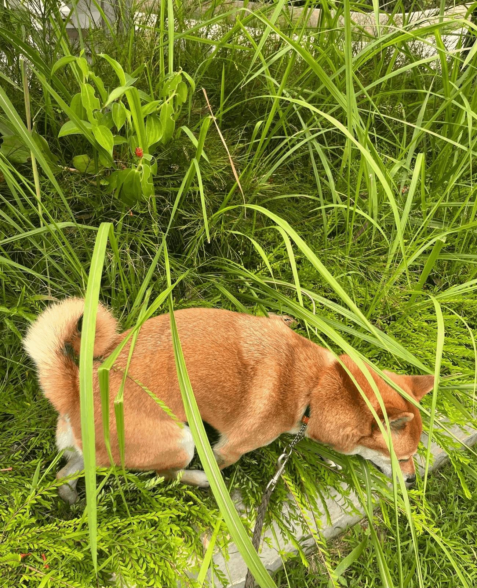

### 9am

<!-- entry-id: e039 -->

Guapo tried to lure Weiwen into the room but failed. Now he's just lying beside her. Please keep being a good boy when Bobbi comes over later tonight, okay?

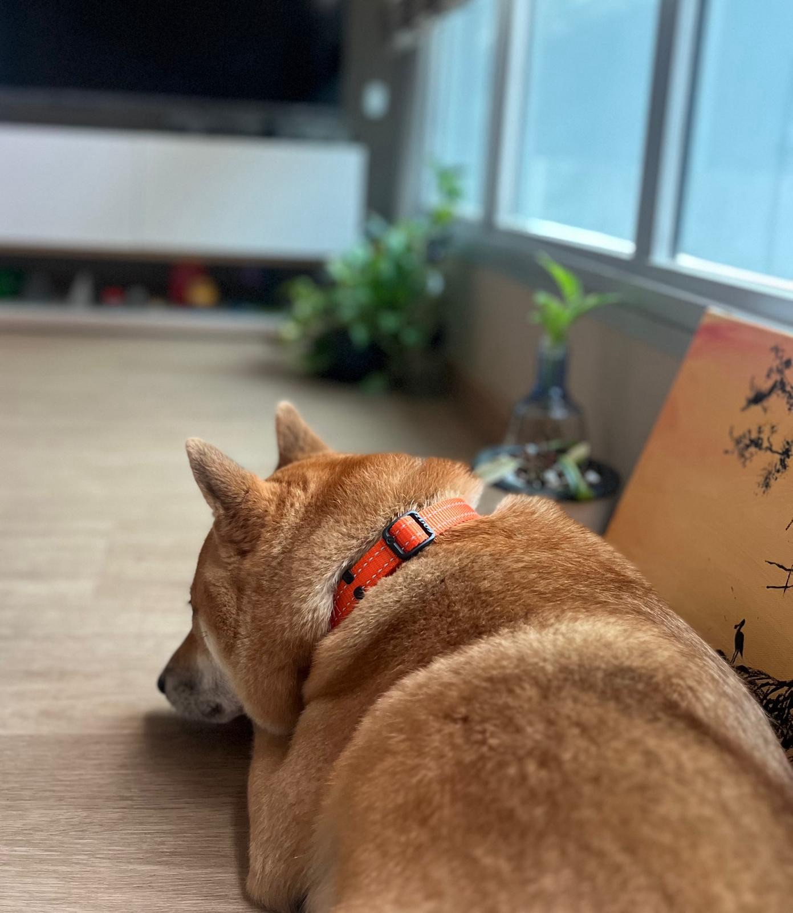

### 7:15am

<!-- entry-id: e040 -->

Guapo got nipped in the butt by an off-leash terrier during this morning's walk. He darted away from the terrier, who was half his size.

## 7 Oct

### 11:04pm

<!-- entry-id: e038 -->

Today’s edition of anywhere but the bed.

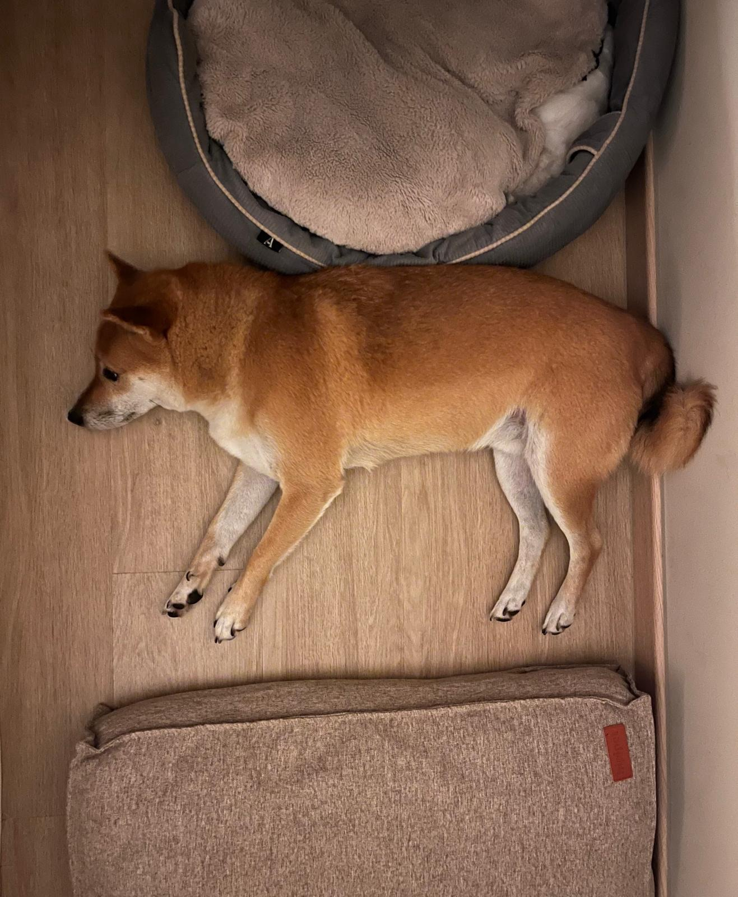

### 9:42pm

<!-- entry-id: e036 -->

Rambo: Reluctant Warrior starring Guapo

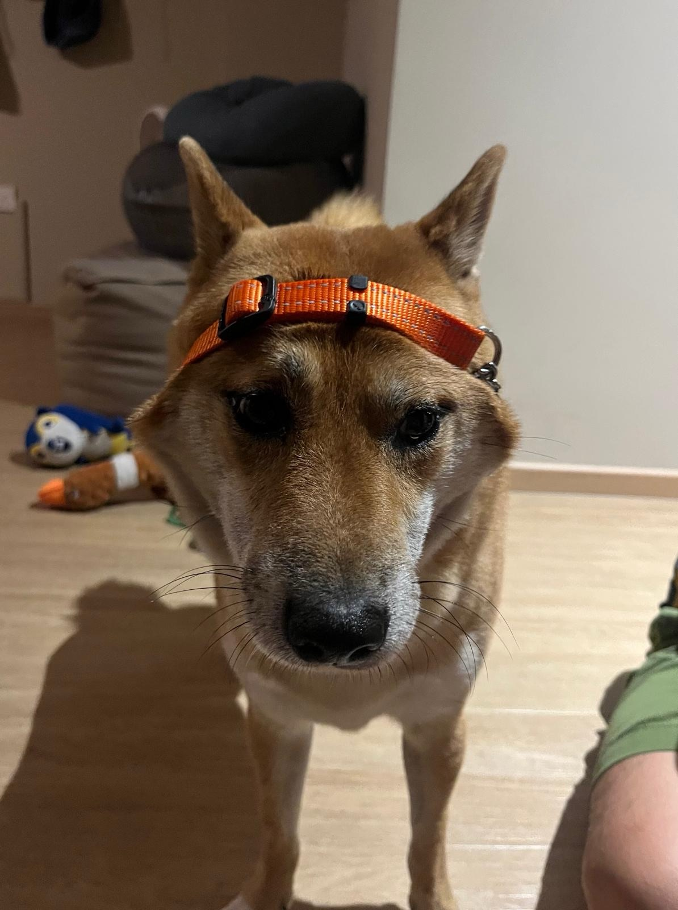

### 6pm

<!-- entry-id: e037 -->

Guapo welcoming Alan home

### 1:55pm

<!-- entry-id: e035 -->

Yawn

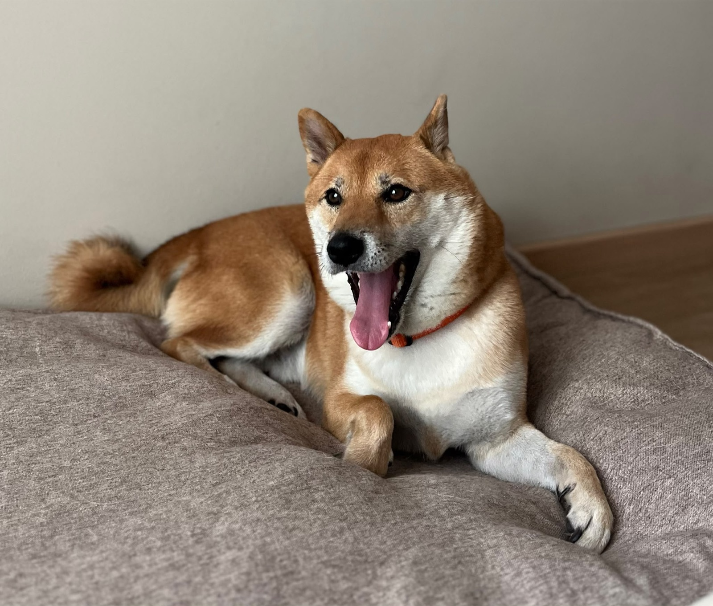

### 7:10am

<!-- entry-id: e034 -->

Guapo refused to go near the dog run, only to meet an overly excited two-year-old Samoyed. He couldn't wait to go back.

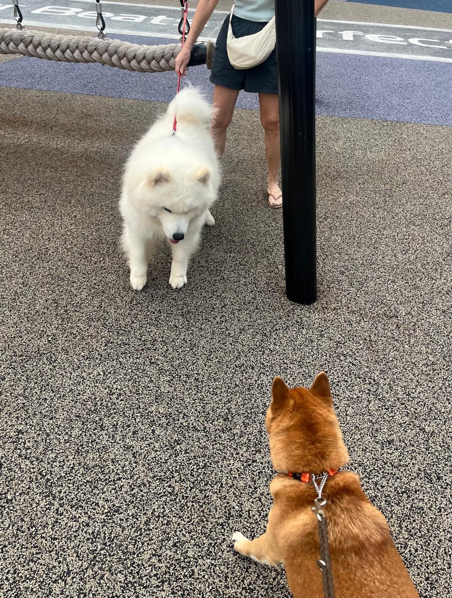

## 6 Oct

### 6:50pm

<!-- entry-id: e032 -->

Guapo being pretty chill with a new friend, Finn.

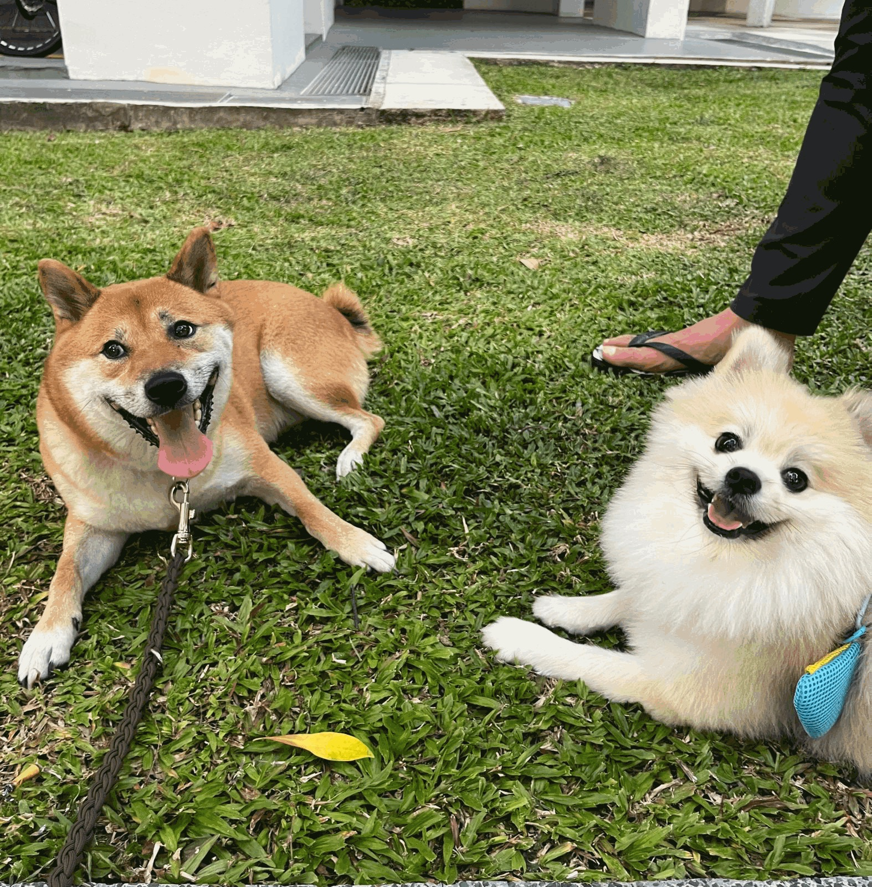

### 6:20pm

<!-- entry-id: e033 -->

Alan trying to play ball with Guapo, and Guapo humouring him.

### 5:20pm

<!-- entry-id: e031 -->

Swooning over how adorable Guapo looks when he rubs his face with his tiny paws. Cat in a dog's body, exhibit A.

### 9:13am

<!-- entry-id: e030 -->

Sleeping position of the day. #SPOTD

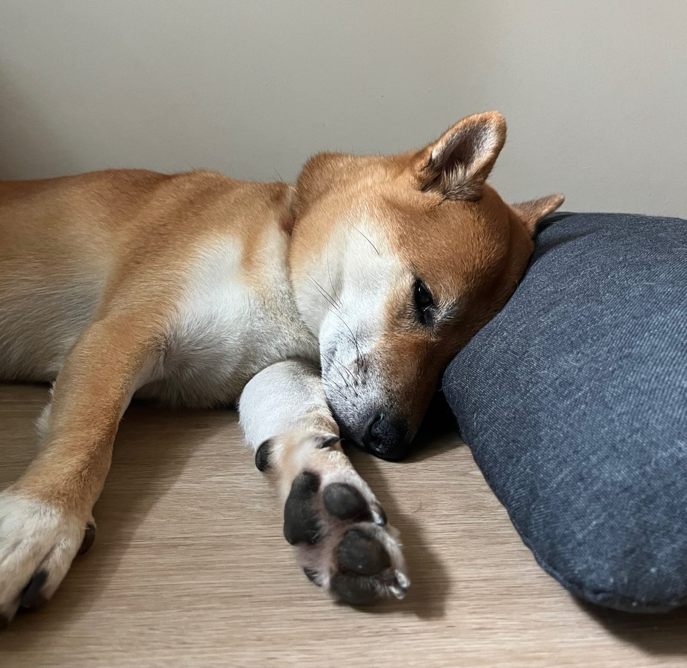

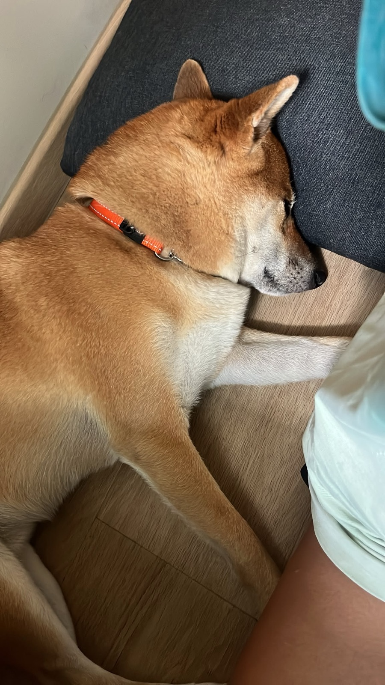

### 8:10am

<!-- entry-id: e029 -->

Post breakfast ~~nap~~ coma.

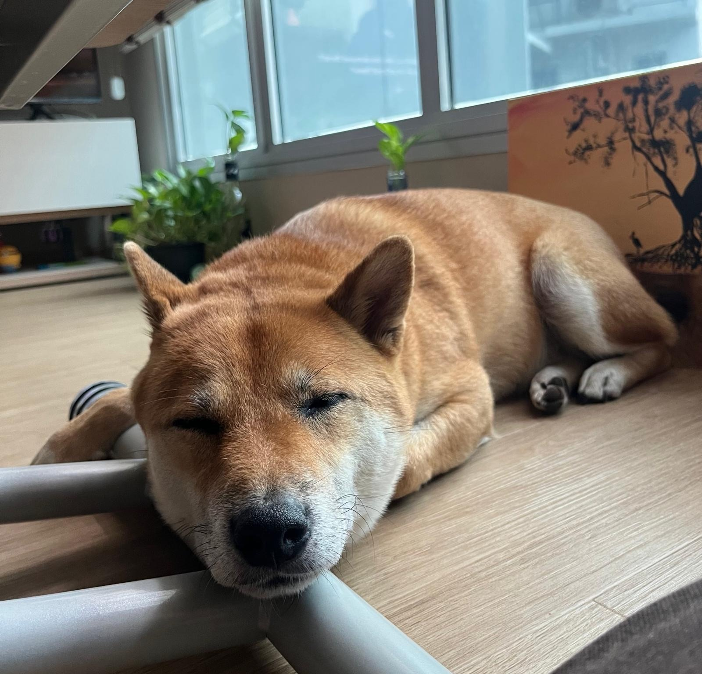

## 5 Oct

### 8:45pm

<!-- entry-id: e027 -->

Apparently it's tiring to sleep all day. Now resting from all that sleep.

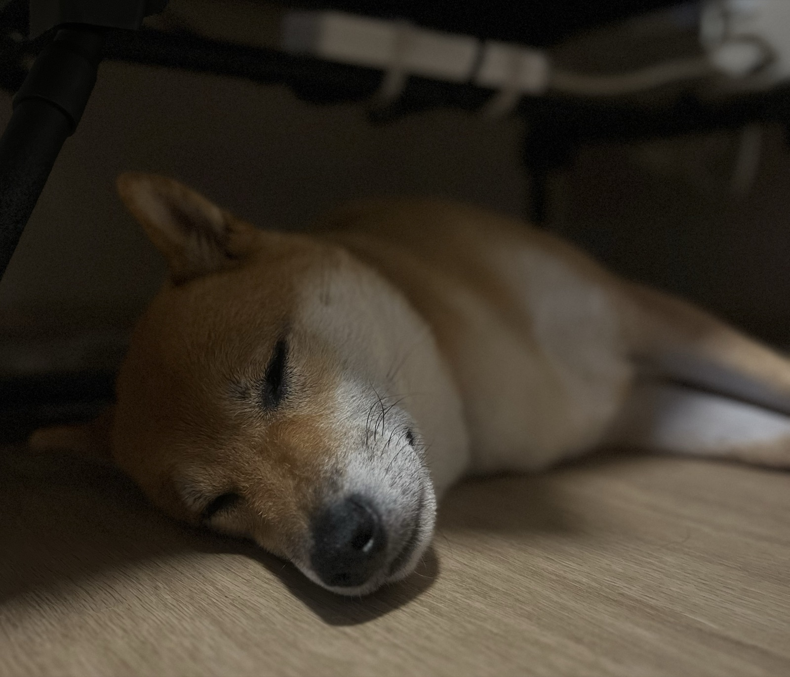

### 7pm

<!-- entry-id: e028 -->

A short jog at the carpark instead. Weiwen trying to get Guapo to chase her.

### 6:30pm

<!-- entry-id: e026 -->

The haze is bad today, so no long walk to the dog run for Guapo. Not that he's complaining.

### 7:20am

<!-- entry-id: e025 -->

Coming back from the morning walk.

## 4 Oct

### 9:24pm

<!-- entry-id: e024 -->

Night-time playground adventure.

### 2:30pm

<!-- entry-id: e023 -->

We only managed to get Guapo to play at home. He likes a fast-moving ball, preferably not a flying one.

### 7:48am

<!-- entry-id: e022 -->

Harassed by a much smaller dog, Guapo didn't bully him. Not bad.

### 6:56am

<!-- entry-id: e021 -->

One cat to rule them all, in all his glory. Guapo, in all his cowardice.

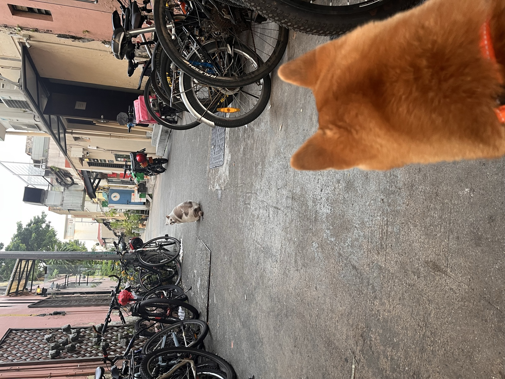

### 6:55am

<!-- entry-id: e020 -->

In the early hours, the fellowship set forth for a new battleground, the dog run of Barkdor. Upon the narrow street en route, Guapo met a formidable foe. A gigantic cat lay there upon the stones, claiming the street as his own. Guapo froze. Whether in awe or in fear, none can say. Alan knew this was a battle not to be fought, and escaped with Guapo, to enter the street by another gate. We pick our battles. One does not simply walk past that cat.

## 3 Oct

### 4pm

<!-- entry-id: e019 -->

“Steady… pee… ahh, that felt good. Alright, done. Wait, I smell pee. Whose is that?” Guapo thinks.

### 3:10pm

<!-- entry-id: e018 -->

Someone was very happy to see Weiwen and Alan back from errands.

### 8am

<!-- entry-id: e017 -->

We took Guapo up to a secret hideout at the top of the multistorey carpark, where the dog owners gather. Milk, Tiny, Ebi, Liesel and co. were in session. Bum sniff exchange made. Then he went to lie down, wondering why anyone would chase each other or a ball when you cannot move a muscle and just lie there.

## 2 Oct

### 10pm

<!-- entry-id: e015 -->

Crocodile feeding session. All fingers accounted for.

### 8:50pm

<!-- entry-id: e016 -->

Guapo getting his teeth cleaned to maintain this million-dollar smile.

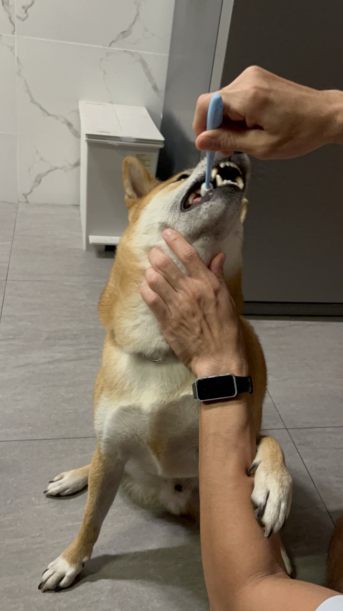

### 7:15pm

<!-- entry-id: e014 -->

Effortlessly looking cute while begging for food. Unfortunately, it seldom works.

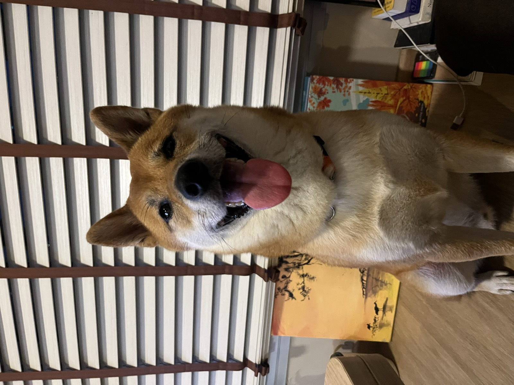

### 11:40am

<!-- entry-id: e013 -->

Post-snack modelling session. Got to earn his keep.

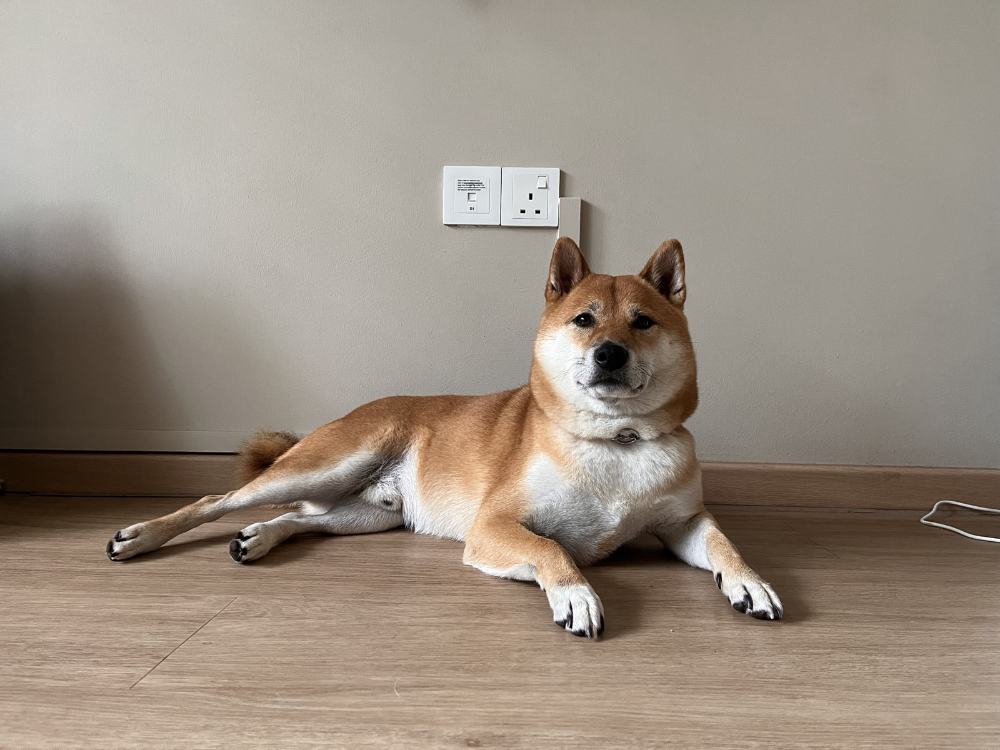

### 11:30am

<!-- entry-id: e012 -->

Got to eat my snacks to maintain my perfect figure, Guapo says.

### 8:56am

<!-- entry-id: e011 -->

Croissant curling nicely in the hot oven. Ready soon.

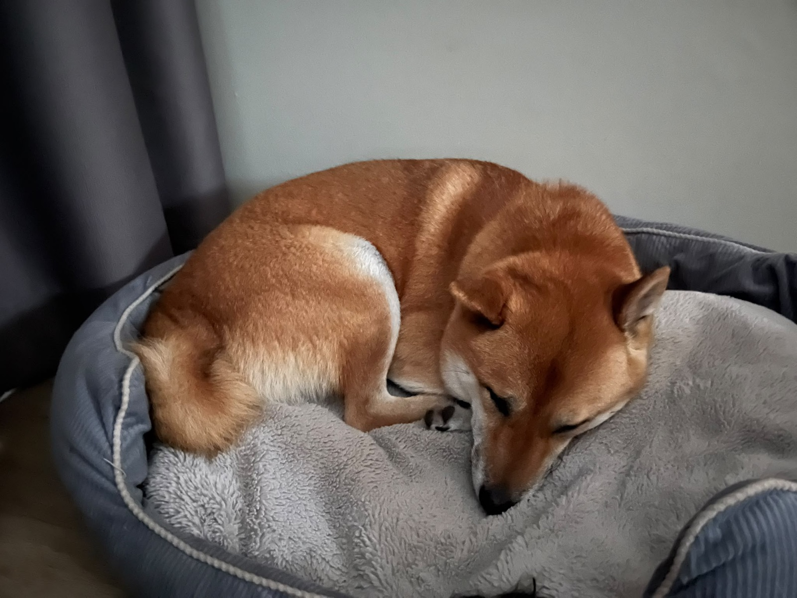

## 1 Oct

### 11:35pm

<!-- entry-id: e010 -->

Extra-thick baguette, fresh out of the oven.

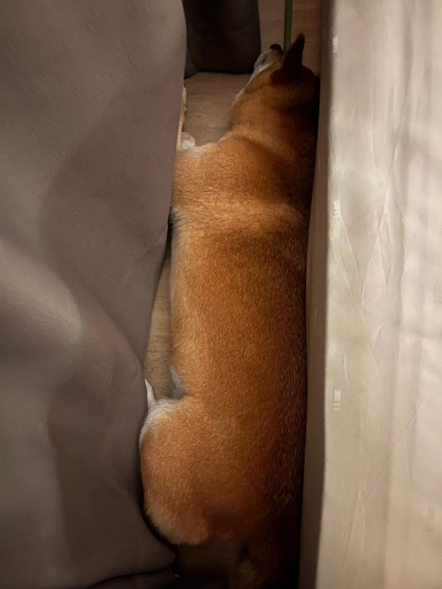

### 1:30pm

<!-- entry-id: e009 -->

Next up on the runway, Guapo. He showcased a sleek, vibrant orange martingale collar with a premium crocodile-hide leather leash… then jumped off the runway without a care in the world.

### 11:10am

<!-- entry-id: e008 -->

New on the menu at Towner Cafe: Soft Fur Croissant.

Golden brown, extra fluffy, and best left to proof in peace.

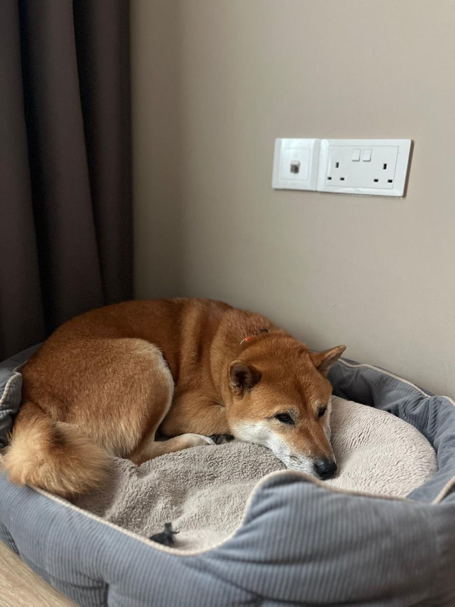

### 7:40am

<!-- entry-id: e007 -->

When the stars and moon align, Guapo plays outside.

## 30 Sep

### 9:45pm

<!-- entry-id: e006 -->

All smiles.

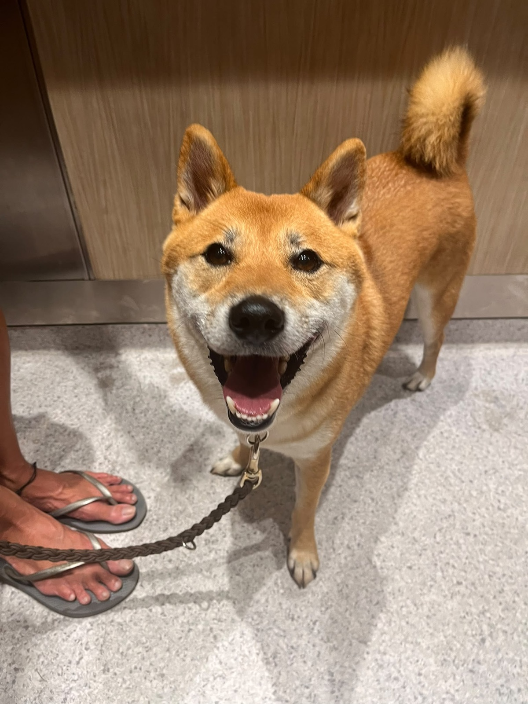

### 6:40pm

<!-- entry-id: e005 -->

I always love it when he looks back at me during walks. Cutest face.

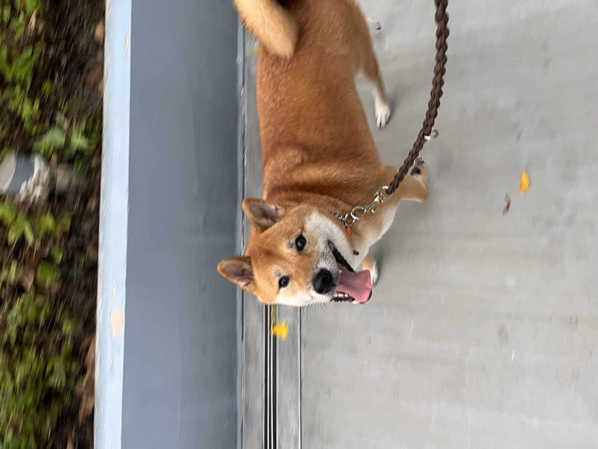

### 11:15am

<!-- entry-id: e004 -->

Emotional shrimp

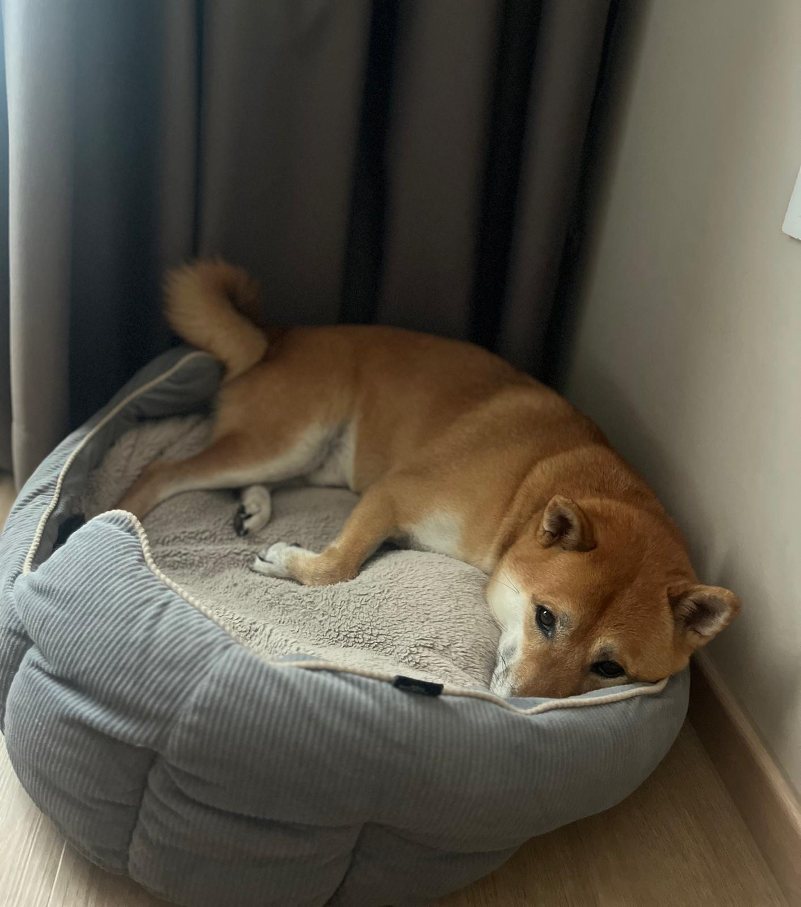

### 9:40am

<!-- entry-id: e003 -->

Guapo settled down, realizing he was stuck with Alan and Weiwen, and now missing his owner.

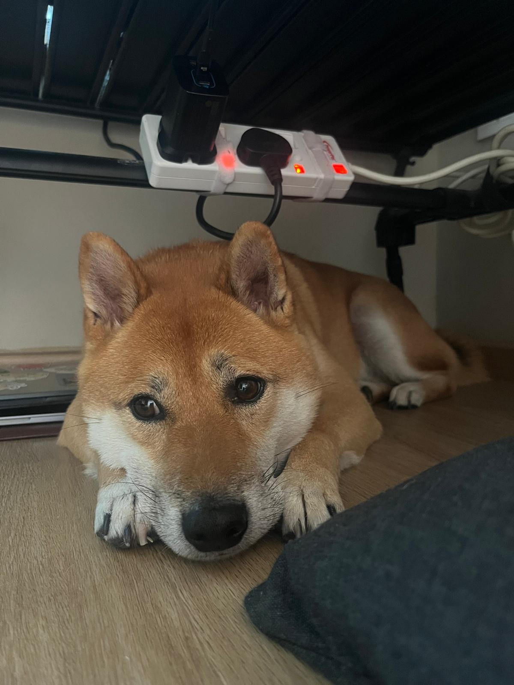

### 9:10am

<!-- entry-id: e002 -->

Guapo crashed in with airplane ears and all smiles, happy to see Weiwen, and bringing along some soil.

### 9:10am

<!-- entry-id: e001 -->

Guapo has arrived. Roll out the red carpet and prepare the cameras. Girls, clear your throats and get ready to scream.
